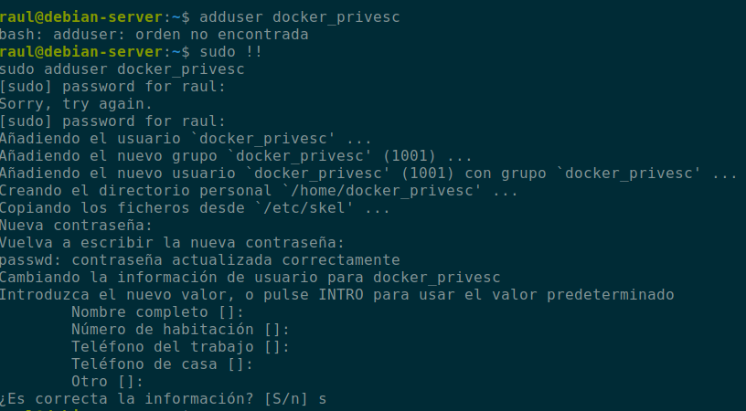
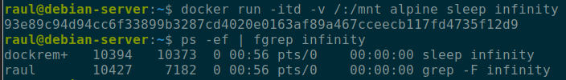

## Explicación teórica

A estas alturas se da por sabido qué es y qué no es Docker y en qué se diferencia de las máquinas virtuales. En caso contrario, existen millones de recursos en Internet para informarse y formarse al respecto.

Como bien explica la [documentación oficial de Docker](https://docs.docker.com/engine/install/linux-postinstall/), el demonio de docker utiliza sockets Unix, cuyo propietario por defecto es `root` y por tanto, el resto de usuarios deberán hacer uso de `sudo` porque el demonio de Docker siempre correrá como usuario `root`.

Para evitarnos tener que utilizar `sudo` siempre que empleemos comandos Docker, existe el grupo `docker` y añadiendo usuarios a él es equivalente a proporcionar privilegios de root a sus usuarios. De ahí surge la posibilidad de la escalada de privilegios que da título a este post.

Además, se debe tener en cuenta que, por defecto, el usuario que corra un contenedor tendrá privilegios `root` dentro del mismo.

Y en este caso hablamos de Docker pero es un problema común a todos los sistemas de contenedores, como por ejemplo [LXD](https://reboare.github.io/lxd/lxd-escape.html) entre otros.

## Caso práctico

Vamos a realizar una comprobación desde cero. Nos cremos el usuario `docker_privesc` y lo añadimos al grupo `docker`:

Es muy habitual que necesitemos eliminar y reinicar un contenedor porque se ha actualizado la imagen o porque se ha actualido el Dockerfile. Por estos motivos, es igual de habitual que necesitemos tene persistencia de datos y hagamos uso de los conocidos como [volúmenes](https://docs.docker.com/storage/volumes/). 

Vamos a crear un contenedor que haga uso de los volúmenes de una forma no recomendable. En primer lugar nos creamos el archivo `root.txt` en el directorio `/root` del sistema:

Ahora corremos un contenedor con una imagen de *alpine* haciendo uso de un volumen que montará en el directorio `/mnt` del contenedor el directorio `/root` de nuestro sistema. 

Observamos que podemos leer sin problemas el archivo creado por root previamente en nuestro sistema. Dicho en otras palabras, tenemos acceso a nuestro sistema como usuario root.

Otra forma aún más obvia de ver el error en el que se puede incurrir con los contenedores, los volúmenes y los privilegios con el que corre el demonio pertinente, podemos verla en la siguiente imagen:

Corremos la imagen de alpine de forma interactiva, indicándole que tendrá un volumen que mapeará el directorio raíz en el directorio `/mnt` del contenedor y que, además, haga un [`chroot`](https://es.wikipedia.org/wiki/Chroot) que convertirá nuestro directorio raíz en el contenedor, en el directorio raíz del sistema. Es decir, ¡somos `root` del sistema anfitrión!

## Mitigación

La misma documentación oficial de Docker ofrece una propuesta de [solución o mitigación](https://docs.docker.com/engine/security/userns-remap/#enable-userns-remap-on-the-daemon) a este problema.

En esencia se nos dice que las aplicacinoes *contenerizadas* deben correr con usuarios no privilegiados. No obstante, si los procesos de un contenedor concrete deben correr como `root` dentro del contenedor, se debe **remapear** este usuario a otro menos privilegiado del sistema anfitrión.

En [este](https://flast101.github.io/docker-privesc/) ejemplo se nos muestra, en el punto dedicado a la mitigación, como creando un usuario llamado `dockremap`, podemos remapearlo a un usuario poco privilegiado. Podemos comprobarlo siguiendo las instrucciones que allí se nos indican:

Vemos que el `sleep`, efectivamente se nos está ejecutando como `root`:

Tras ejecutar el script que aplica los pasos de mitigación explicados en la documentación oficial:

El sleep ahora está ejecutado por el usuario `dockremap`. Así pues, quedamos protegidos de la escalada de privilegios mientras que en el contenedor el usuario que ejecuta los procesos sí es `root`
