## Explicación teórica


### ¿Qué es JSON?
JSON es el acrónimo de JavaScript Object Notation y es un formato basado en texto para transmitir información entre aplicaciones web. Almacena la información de una forma tal que hace muy fácil el acceder a ella, tanto para desarrolladores como para las máquinas. 

También puede ser usado como formato de datos por cualquier lenguaje de programación y de heco se está convirtiendo rápidamente en la sintaxis preferida para las APIs, superando a XML.

### ¿Qué es un JSON Web Token (JWT)?

JWT es ya una técnica muy popular para securizar APIs, así como ha conseguido (y sigue haciéndolo) gran popularidad también en muchos CTF.

En esencia, JWT es un estándar abierto utiliziado para compartir información entre dos partes, cliente y servidor. Cada JWT incluye objetos JSON codificados. Los JWT se firman utilzando algoritmos criptográficos con el fin de asegurar que no han sido modificados una vez han sido emitidos.

Dos de sus grandes ventajas son:

* **Compactos:** debido a su tamaño, se pueden enviar en una URL, como un parámetro POST o dentro de una cabecera HTTP. Además, este reducido tamaño hace que la transmisión sea más rápida.
* **Autocontenidos:** el "payload" contiene toda la información que se necesita del usuario, evitando así consultar a la base de datos más de una vez.

### ¿Cuándo usar JWTs?

Hay dos escenarios donde este tipo de token es útil:

* **Autenticación:** Es el escnario típico en el que se usan los JWTs. Una vez logueado, cada petición a partir de ese momento irá acompañada del JWT, permitiendo el acceso a las rutas, servicios y recursos que correspondan a ese token. 

* **Intercambio de información:** Los JWTs son una buena forma de transmitir información de forma segura entre las partes porque estos tokens pueden firmarse, por ejemplo con claves pública/privada. Esto también permite aseugrar la integridad puesto que la firma se calcula usando la información del token, el header y el payload, que veremos a continuación.

### Estructura de un JWT

Un JWT está formado por tres partes separadas por un punto entre ellas. Estas partes se conocen como:
* Header
* Payload
* Signature

Por lo que el formato típico de un JWT sería: `xxxxxxx.yyyyyyy.zzzzzzz` 

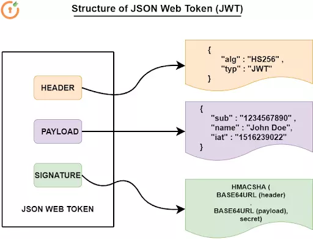

#### Header
En header típicamente tiene dos partes: el tipo de token `typ` y el algoritmo de firma utilizado `alg`. 

Se pueden utilizar multitud de algoritmos pero los más conocidos son:

+ **HS256:** Simétrico, es decir, utiliza el mismo secret para firmar que para verificar. Más rápido ya que el procesado es más sencillo y el token resultante más pequeño.

+ **RS256:** Asimétrico (par de claves pública/privada). La clave privada se utiliza en el firmado y la pública para verificar la firma.

Por último, este JSON se codificada en formato `Base64Url`

#### Payload
La segunda parte del token es el payload, que contiene los conocidos como `claims`. Estos `claims` hacen referencia, por norma general, a datos del usuario y metadatos adicionales. Pueden ser de tres tipos:

+ **Reserved:** Son claims predefinidos, que si bien no son obligatorios, son bastante recomendados.
+ **Public:** Se pueden definir a voluntad por aquellos que usen los JWTs. No obstante, para evitar colisiones, se deben definiar en la IANA JSON Web TOken Registry.
+ **Private:** Son claims customizados creados con el fin de compartir información entre las partes que han acordado utilizarlos.

El payload, como veíamos en la imagen de arriba, también se codifica en `Base64Url`. 


#### Signature

Para la firma, se utiliza la parte codificada del header, la parte codificada del payload, un `secret` y el algoritmo especificado en el header. Un ejemplo de esto en pseudocódigo sería:

```
HMACSHA256(
  base64UrlEncode(header) + "." +
  base64UrlEncode(payload),
  secret)
```

**Atención**

Firmar el token asegura su integridad, es decir, nos certifica que la información que contiene no ha sido modificada. No obstante, este token está codificado, que no cifrado, por lo que cualquier información que contenga podrá ser visualizada sin problemas.
	
Para asegurar la confidencialidad de los datos, se recomienda utilizar cifrado, como por ejemplo HTTPS entre los participantes de la conversación.

## Caso práctico

Vamos a ver algunos casos de mala utilización de los JWTs y de qué manera pueden ser "abusados". Para ello vamos a utilizar [un estupendo laboratorio](https://jwt-lab.herokuapp.com/challenges) que alguien ha tenido a bien montar para que cualquiera pueda usarlo. En este laboratorio hay una serie de [challenges](https://jwt-lab.herokuapp.com/challenges) a realizar. Veamos algunos de ellos.

### Vulnerabilidad "none algorithm "

JWT permite utilizar para el claim `alg` el valor `none`. Es decir, si sustituimos el algoritmo de firma que se esté utilizando por el valor none y dejamos el campo `signature` vacío, el token será considerado como correcto y podremos suplantar a otros usuarios. 

Veamos cómo proceder.

1. En primer lugar registraremos un nuevo usuario que será el que utilicemos para todas nuestras subsiguientes pruebas. Si accedemos al link: https://jwt-lab.herokuapp.com/users/new y rellenamos los datos, tendremos listo nuestro usuario:
     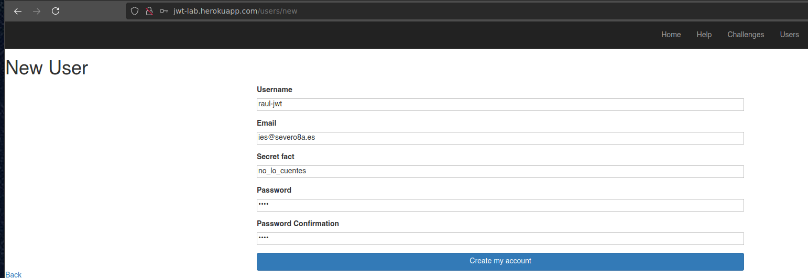

2. Tras ello, nos dirigimos a la URL para este challenge: https://jwt-lab.herokuapp.com/authentication/none y nos logueamos con el usuario que acabamos de crear
   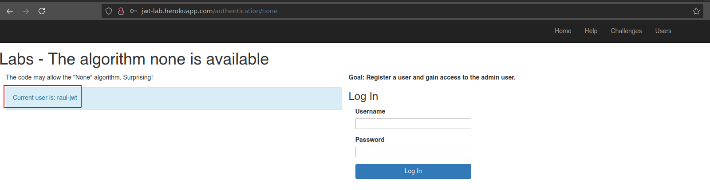

3. Si examinamos las peticiones y respuestas del proceso de login, veremos que tal y como dicta la teoría, tras realizarse el proceso de login, se genera y se devuelve un JWT al cliente:
   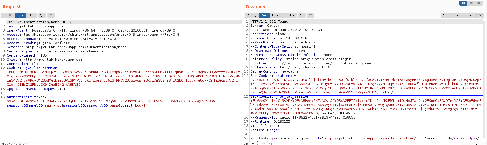

      Que es el que el cliente efectivamente utiliza a partir de ese momento en sus peticiones:
      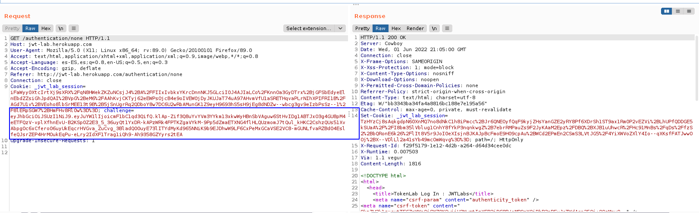

4. Vamos a ver como sería este token decodificado. Envíamos la petición al *repeater* de Burp y el token al plugin **JSON Web Tokens**:
   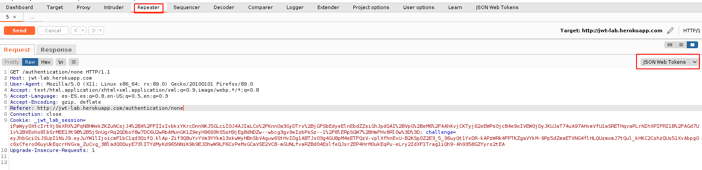

      Y de esta forma podemos observar el algoritmo que se está utilizando para la firma en el Header y el nombre el usuario en el Payload, así como la firma en la parte del Signature.
      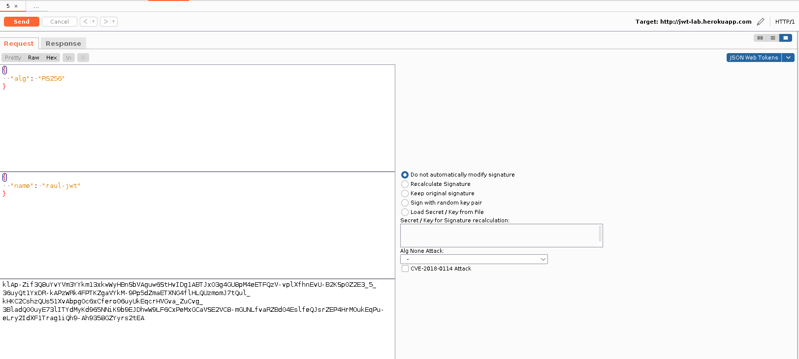

5. Si ahora, utilizando el plugin previamente mencionado, le decimos que vamos a realizar un `Alg None attack` y además, le decimos que vamos a suplantar al usuario `admin`, dejando además el campo Signature vacío:
   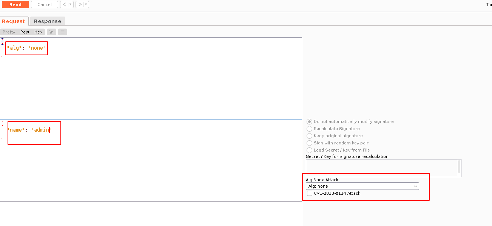

   Y reenviamos esta petición:
   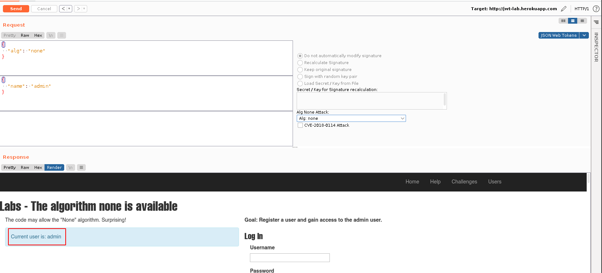

   Hemos conseguido convertirnos en `admin`, puesto que al admitirse el valor *none* para *alg*, este token se considera válido y nos identifica de forma correcta.
 

## No se comprueba el "signature"

Un gran fallo de seguridad al utilizar JWT es que no se comprueba el valor del `signature` cuando se recibe en el servidor. Así pues, un usuario malintencionado podría utilizar un signature inválido y hacer pasar el token por válido para, de esta forma, suplantar a otro usuario.

Veamos cómo proceder:

1. Identificamos la petición inicial correcta, con la firma correspondiente y el usuario original `raul-jwt`
    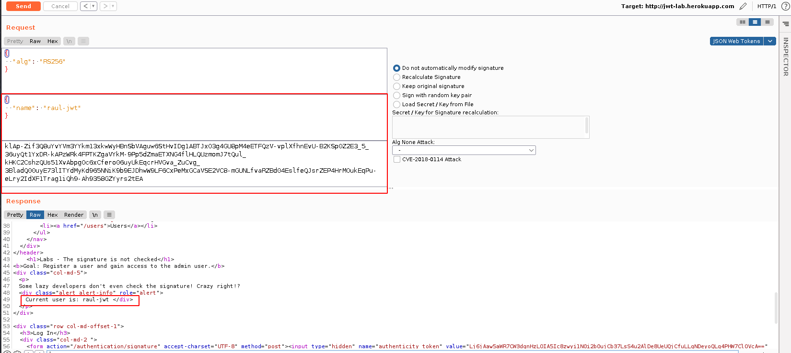  

2. Si eliminamos la firma y le decimos que queremos suplantar la identidad del usuario `admin`, al no comprobarse la firma, tendremos éxito en nuestros maliciosas intenciones:
      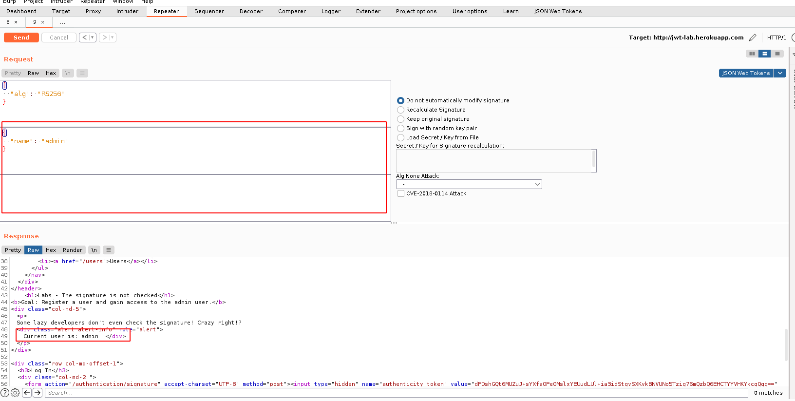


## El valor del "signature" no es lo suficientemente robusto
Si el valor utilizado para la firma no es lo suficientemente robusto, podría ser susceptible a ataques de fuerza bruta. Veamos la demostración:


1. En primer lugar accedemos a la URL para este challenge: https://jwt-lab.herokuapp.com/authentication/signature y nos logueamos con nuestro usuario.
   

2. Volvemos a identificar el nuevo token:
    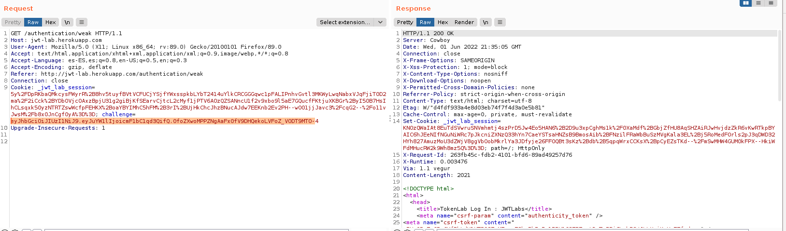

3. Con la ayuda de hashcat el diccionario rockyou.txt, crackeamos el valor del secreto utilizdo para generar la firma:
    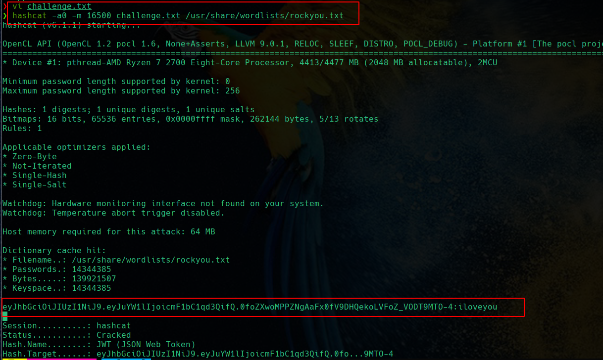

4. Y comprobamos que haciendo uso de este valor crackeado podemos convertirnos en el usuario admin, recalculando el valor de la firma:
    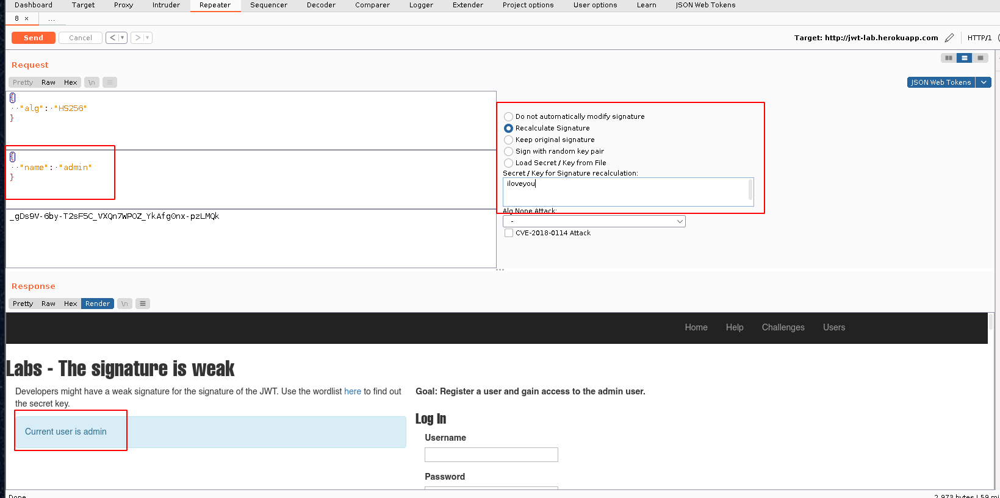


Y, por si alguien estuviera interesado, existen algunos challenges más en el laboratorio, así como los [walkthroughs](https://adamc95.medium.com/json-web-token-lab-guide-c402857fa44c) correspondientes en la página del autor.


## Referencias:

[Shellcon](https://sh3llcon.org/jwt-for-beginners/)

[Auth0](https://auth0.com/learn/json-web-tokens/)

[Akana](https://www.akana.com/blog/what-is-jwt)

[Miniorange](https://blog.miniorange.com/what-is-jwt-json-web-token-how-does-jwt-authentication-work/)

[Challenges walkthroughs](https://adamc95.medium.com/json-web-token-lab-guide-c402857fa44c)
